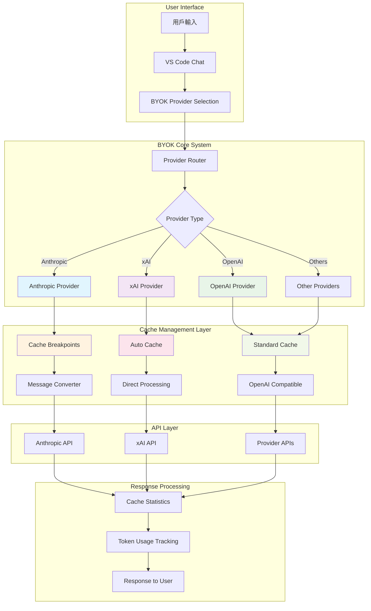
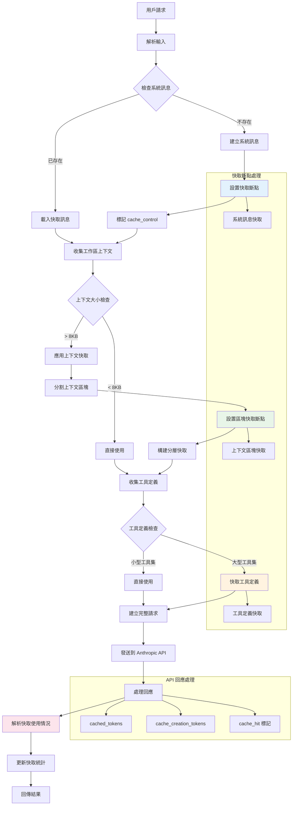
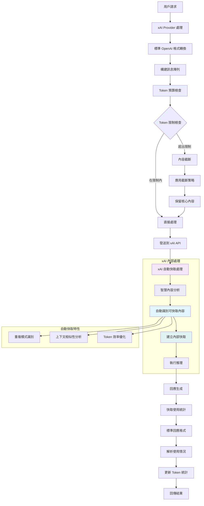
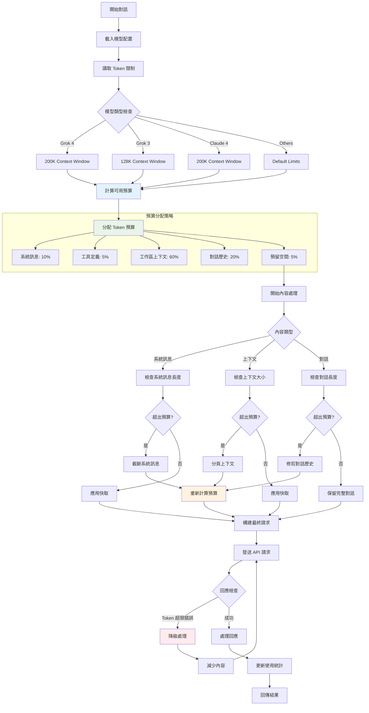
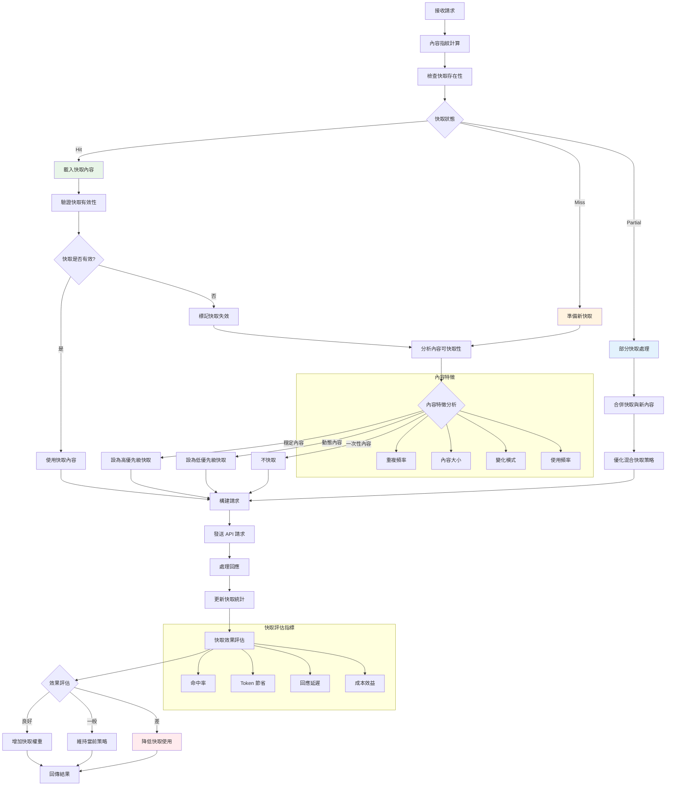
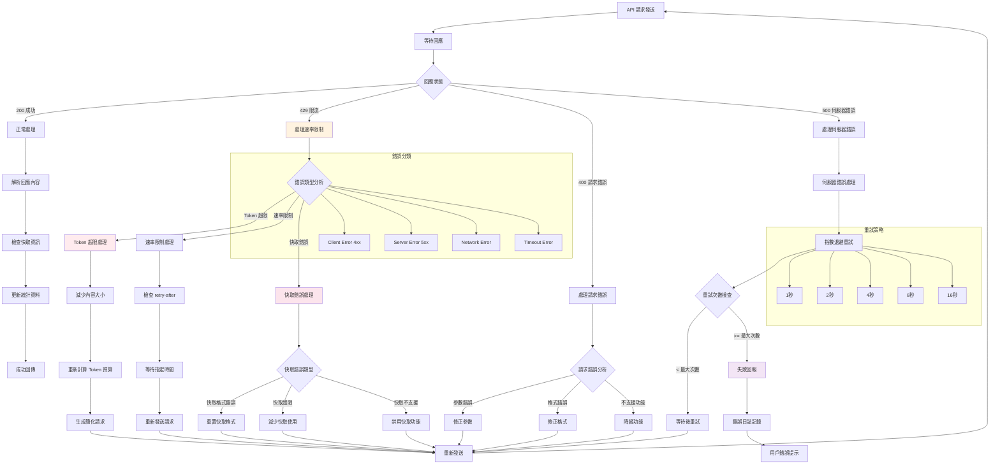

# BYOK Cache System Flowcharts

本文檔包含 BYOK 快取系統的詳細流程圖，使用 Mermaid 語法繪製。

## 1. 整體快取系統架構圖

## 2. Anthropic Claude 快取流程

## 3. xAI Grok 自動快取流程

## 4. Token 預算管理流程

## 5. 快取命中決策流程

## 6. 錯誤處理和恢復流程

## 使用說明

這些流程圖可以幫助開發者理解：

1. **整體架構**: 了解 BYOK 快取系統的完整結構
2. **提供者特定流程**: 理解不同 AI 提供者的快取實現差異
3. **Token 管理**: 掌握 Token 預算分配和使用策略
4. **快取決策**: 了解快取命中和失誤的處理邏輯
5. **錯誤處理**: 學習如何處理各種錯誤情況和恢復策略

每個流程圖都包含了關鍵決策點和處理路徑，可以作為代碼實現和問題排除的參考。

---

*生成工具: Mermaid*
*最後更新: 2025年7月18日*
