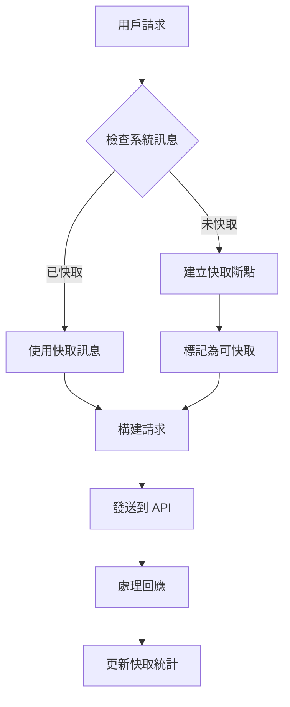
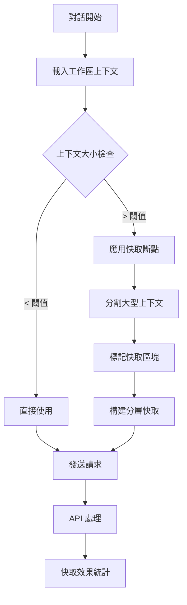

# BYOK Cache System 快取系統導讀

## 概述

BYOK (Bring Your Own Key) 系統支援多種 AI 提供者的快取機制，以提升效能並降低 API 成本。本文檔詳細介紹不同提供者的快取實現方式和最佳實踐。

## 目錄

1. [快取系統架構](#快取系統架構)
2. [提供者特定實現](#提供者特定實現)
3. [快取策略](#快取策略)
4. [最佳實踐](#最佳實踐)
5. [故障排除](#故障排除)

## 快取系統架構

### 核心組件

```
┌─────────────────────────────────────────────────────────────┐
│                    BYOK Cache System                        │
├─────────────────────────────────────────────────────────────┤
│  ┌─────────────────┐  ┌─────────────────┐  ┌─────────────────┐ │
│  │   Anthropic     │  │      xAI        │  │   OpenAI        │ │
│  │   (Explicit)    │  │  (Automatic)    │  │ (Compatible)    │ │
│  └─────────────────┘  └─────────────────┘  └─────────────────┘ │
├─────────────────────────────────────────────────────────────┤
│              Cache Breakpoints System                       │
│              (cacheBreakpoints.ts)                         │
├─────────────────────────────────────────────────────────────┤
│              Message Conversion Layer                       │
│              (anthropicMessageConverter.ts)                │
├─────────────────────────────────────────────────────────────┤
│              OpenAI-Compatible Base                        │
│              (openai.ts)                                   │
└─────────────────────────────────────────────────────────────┘
```

### 快取類型

1. **Prompt Cache (提示快取)**
   - 快取常用的系統提示和上下文
   - 減少重複計算和 token 傳輸

2. **Response Cache (回應快取)**
   - 快取相似查詢的回應
   - 提供更快的回應時間

3. **Context Cache (上下文快取)**
   - 快取對話歷史和工作區上下文
   - 支援長對話和複雜任務

## 提供者特定實現

### 1. Anthropic Claude - 明確快取控制

#### 檔案位置
- `src/extension/context/common/cacheBreakpoints.ts`
- `src/platform/anthropic/common/anthropicMessageConverter.ts`

#### 實現特點
```typescript
// 快取斷點定義
export interface CacheBreakpoint {
    type: 'system' | 'user' | 'assistant';
    content: string;
    cacheControl?: {
        type: 'ephemeral';
    };
}

// 使用範例
const systemMessage = {
    role: 'system',
    content: '你是一個程式設計助手...',
    cache_control: { type: 'ephemeral' }
};
```

#### 快取策略
- **系統訊息快取**：自動快取系統提示
- **長上下文快取**：快取大型程式碼區塊
- **工具定義快取**：快取常用工具描述

#### 配置選項
```typescript
const cacheConfig = {
    enableSystemMessageCache: true,
    enableToolDefinitionCache: true,
    maxCacheSize: 32768, // tokens
    cacheTimeout: 3600   // seconds
};
```

### 2. xAI Grok - 自動快取

#### 檔案位置
- `src/extension/byok/vscode-node/xaiProvider.ts`
- 基於 OpenAI-compatible 協議

#### 實現特點
```typescript
// xAI 自動處理快取，無需明確控制
class XAIModelRegistry extends BaseOpenAICompatibleBYOKRegistry {
    protected getBaseURL(): string {
        return 'https://api.x.ai/v1';
    }

    // 快取由 API 端自動處理
    // 使用標準 OpenAI 格式，xAI 自動優化
}
```

#### 自動快取機制
- **智慧快取**：API 自動識別可快取內容
- **使用情況追蹤**：透過標準回應標頭報告快取使用
- **透明操作**：開發者無需額外配置

### 3. OpenAI-Compatible 提供者

#### 檔案位置
- `src/platform/networking/common/openai.ts`

#### 實現特點
```typescript
// 標準 OpenAI 快取處理
export interface ChatCacheInfo {
    cached_tokens?: number;
    cache_hit?: boolean;
    cache_creation_input_tokens?: number;
}

// 快取使用情況追蹤
const response = await fetch(endpoint, {
    method: 'POST',
    headers: {
        'Content-Type': 'application/json',
        'Authorization': `Bearer ${apiKey}`
    },
    body: JSON.stringify({
        model: 'gpt-4',
        messages: messages,
        // 快取相關參數會自動處理
    })
});
```

## 快取策略

### 1. 系統訊息快取策略



### 2. 上下文快取策略



### 3. Token 預算管理

```typescript
// Token 預算分配
const tokenBudget = {
    system: 2000,        // 系統訊息
    context: 150000,     // 上下文內容
    tools: 5000,         // 工具定義
    conversation: 40000, // 對話歷史
    reserve: 3000        // 預留空間
};

// 快取優先順序
const cachePriorities = [
    'system_messages',    // 最高優先級
    'tool_definitions',   // 高優先級
    'workspace_context',  // 中等優先級
    'conversation_history' // 低優先級
];
```

## 最佳實踐

### 1. 快取設計原則

#### ✅ 推薦做法
```typescript
// 1. 穩定的系統訊息
const systemPrompt = {
    role: 'system',
    content: 'You are a helpful coding assistant...',
    cache_control: { type: 'ephemeral' }
};

// 2. 大型上下文分塊
const codeContext = splitIntoChunks(largeCodebase, {
    maxChunkSize: 8192,
    preserveStructure: true,
    enableCaching: true
});

// 3. 工具定義快取
const toolDefinitions = {
    tools: availableTools,
    cache_control: { type: 'ephemeral' }
};
```

#### ❌ 避免的做法
```typescript
// 1. 頻繁變動的內容不適合快取
const dynamicContent = {
    role: 'user',
    content: `Current time: ${Date.now()}`, // 每次都不同
    cache_control: { type: 'ephemeral' }    // 浪費
};

// 2. 過小的內容不值得快取
const tinyPrompt = {
    role: 'system',
    content: 'Hi',                          // 太小
    cache_control: { type: 'ephemeral' }    // 無意義
};
```

### 2. 效能優化技巧

#### 快取命中率優化
```typescript
// 標準化系統訊息
const standardizeSystemMessage = (prompt: string) => {
    return prompt
        .trim()
        .replace(/\s+/g, ' ')  // 統一空白字符
        .toLowerCase();         // 統一大小寫
};

// 上下文去重
const deduplicateContext = (contexts: string[]) => {
    const seen = new Set();
    return contexts.filter(ctx => {
        const hash = hashContent(ctx);
        if (seen.has(hash)) return false;
        seen.add(hash);
        return true;
    });
};
```

#### 快取失效策略
```typescript
const cacheInvalidation = {
    timeBasedTTL: 3600,      // 1小時後失效
    versionBased: true,       // 版本變更時失效
    sizeBased: 50 * 1024 * 1024, // 50MB 上限
    usageBasedLRU: true      // 最少使用先淘汰
};
```

### 3. 監控和調試

#### 快取統計追蹤
```typescript
interface CacheMetrics {
    hitRate: number;           // 命中率
    missRate: number;          // 失誤率
    tokensSaved: number;       // 節省的 tokens
    costReduction: number;     // 成本降低
    averageLatency: number;    // 平均延遲
}

// 監控實現
const trackCacheUsage = (response: APIResponse) => {
    const metrics = {
        cached_tokens: response.usage?.cached_tokens || 0,
        cache_hit: response.cache_hit || false,
        total_tokens: response.usage?.total_tokens || 0
    };

    telemetryService.track('cache_usage', metrics);
};
```

#### 調試工具
```typescript
// 快取調試模式
const debugCache = (enabled: boolean) => {
    if (enabled) {
        console.log('Cache breakpoints:', cacheBreakpoints);
        console.log('Cache statistics:', cacheStats);
        console.log('Token distribution:', tokenDistribution);
    }
};

// VS Code 設定
{
    "copilot.byok.cache.debug": true,
    "copilot.byok.cache.verbose": false,
    "copilot.byok.cache.metrics": true
}
```

## 故障排除

### 常見問題與解決方案

#### 1. 快取命中率低
**症狀**: Token 使用量沒有明顯減少
**原因**:
- 系統訊息經常變動
- 上下文碎片化
- 快取斷點設置不當

**解決方案**:
```typescript
// 檢查快取配置
const validateCacheConfig = () => {
    if (systemMessage.length < 100) {
        console.warn('System message too short for caching');
    }

    if (cacheBreakpoints.length === 0) {
        console.warn('No cache breakpoints defined');
    }

    if (contextChunks.every(chunk => chunk.length < 1000)) {
        console.warn('All context chunks too small for effective caching');
    }
};
```

#### 2. 快取相關錯誤
**症狀**: API 回傳快取相關錯誤
**原因**:
- 快取 token 超出限制
- 快取格式不正確
- 提供者不支援快取

**解決方案**:
```typescript
// 錯誤處理
const handleCacheError = (error: APIError) => {
    if (error.code === 'cache_limit_exceeded') {
        // 降低快取使用量
        reduceCacheUsage();
    } else if (error.code === 'invalid_cache_format') {
        // 重置快取格式
        resetCacheFormat();
    } else if (error.code === 'cache_not_supported') {
        // 禁用快取
        disableCache();
    }
};
```

#### 3. 效能問題
**症狀**: 請求延遲增加
**原因**:
- 快取處理開銷
- 複雜的快取邏輯
- 網路延遲

**解決方案**:
```typescript
// 效能優化
const optimizeCache = () => {
    // 簡化快取邏輯
    simplifyBreakpoints();

    // 並行處理
    Promise.all([
        processCacheBreakpoints(),
        buildRequestBody(),
        validateTokenLimits()
    ]);

    // 快取預熱
    preWarmCache();
};
```

### 調試檢查清單

- [ ] 檢查提供者是否支援快取
- [ ] 驗證快取斷點配置
- [ ] 確認 token 限制設置
- [ ] 監控快取命中率
- [ ] 檢查錯誤日誌
- [ ] 測試不同快取策略
- [ ] 驗證成本節省效果

## 結論

BYOK 快取系統提供了靈活且高效的快取機制，不同提供者有不同的實現方式：

- **Anthropic**: 明確控制，需要手動設置快取斷點
- **xAI**: 自動處理，透明且智慧化
- **OpenAI-Compatible**: 標準化接口，支援多種提供者

正確使用快取系統可以顯著降低 API 成本並提升回應速度。建議根據具體使用場景選擇合適的快取策略，並持續監控快取效果以進行優化。

---

*最後更新: 2025年7月18日*
*版本: 1.0*
