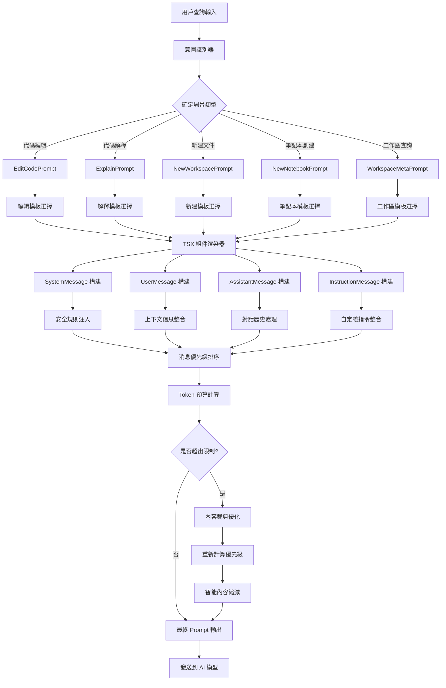

# 動態 Prompt 構建系統 (Dynamic Prompt Construction)

## 🎯 系統概述

動態 Prompt 構建系統是基於 TSX 框架的智能提示詞生成系統，它能夠根據不同的使用場景、用戶意圖和上下文信息，動態組合和調整 prompt 的結構和內容，確保 AI 模型能夠理解用戶的真實需求並生成最合適的回答。

## 🔄 系統架構流程圖



## 🧩 核心組件

### 1. TSX Prompt 框架
**位置**: `src/extension/prompts/node/`

**功能**:
- 基於 React TSX 的組件化 prompt 構建
- 支持條件渲染和動態內容
- 提供可重用的 prompt 組件

**核心文件**:
- `base/promptRenderer.ts` - Prompt 渲染引擎
- `base/instructionMessage.tsx` - 指令消息組件
- `base/responseTranslationRules.tsx` - 回應翻譯規則

### 2. 場景特化 Prompt
**位置**: `src/extension/prompts/node/panel/`

**功能**:
- 針對不同使用場景的專用 prompt 模板
- 智能選擇最適合的 prompt 結構
- 動態調整 prompt 內容

**關鍵場景**:
- **代碼編輯**: `editCodePrompt.tsx`, `editCodePrompt2.tsx`
- **代碼解釋**: `explain.tsx`
- **工作區操作**: `workspace/metaPrompt.tsx`
- **新建項目**: `newWorkspace/newWorkspace.tsx`

### 3. 消息類型系統
**功能**:
- `SystemMessage` - 系統規則和身份設定
- `UserMessage` - 用戶查詢和請求
- `AssistantMessage` - AI 助手回應
- `InstructionMessage` - 特殊指令和規則

### 4. 動態內容整合器
**功能**:
- 自動整合上下文信息
- 處理對話歷史
- 注入安全規則和自定義指令

## 💡 TSX 組件化設計

### 基礎 Prompt 元素

```tsx
// 系統消息組件
<SystemMessage priority={1000}>
    <CopilotIdentityRules />
    <SafetyRules />
    <EditorIntegrationRules />
</SystemMessage>

// 用戶消息組件
<UserMessage priority={900}>
    <ChatVariables chatVariables={variables} />
    <UserQuery query={userInput} />
</UserMessage>

// 指令消息組件
<InstructionMessage priority={800}>
    <CustomInstructions instructions={userInstructions} />
    <CodeBlockFormattingRules />
</InstructionMessage>
```

### 條件渲染邏輯

```tsx
export class EditCodePrompt extends PromptElement {
    async render() {
        const hasTools = this.props.availableTools?.length > 0;
        const isAgent = this.props.location === 'agent';
        
        return (
            <>
                <SystemMessage priority={1000}>
                    <CopilotIdentityRules />
                    {isAgent && <AgentSpecificRules />}
                </SystemMessage>
                
                {hasTools && (
                    <InstructionMessage priority={750}>
                        <ToolUsageInstructions tools={this.props.availableTools} />
                    </InstructionMessage>
                )}
                
                <ConversationHistory 
                    history={this.props.history}
                    priority={700}
                />
                
                <EditCodeUserMessage 
                    query={this.props.query}
                    workingSet={this.props.workingSet}
                    priority={900}
                />
            </>
        );
    }
}
```

## 🎛️ 優先級和預算管理

### 1. 消息優先級系統

```typescript
interface PromptMessage {
    content: string;
    type: 'system' | 'user' | 'assistant' | 'instruction';
    priority: number;  // 1000 = 最高優先級, 100 = 最低優先級
    flexGrow?: number; // 彈性成長因子
}
```

### 2. Token 預算分配

```typescript
class PromptSizing {
    tokenBudget: number;        // 總 token 預算
    reservedTokens: number;     // 保留 token (用於回應)
    availableTokens: number;    // 可用 token
    
    allocateByPriority(messages: PromptMessage[]): PromptMessage[] {
        // 按優先級分配 token
        // 高優先級消息優先保留
        // 低優先級消息可能被截斷或省略
    }
}
```

### 3. 智能內容縮減

```typescript
class ContentOptimizer {
    // 智能縮減策略
    optimizeContent(content: string, maxTokens: number): string {
        // 1. 移除不必要的空白和註解
        // 2. 縮短過長的代碼示例
        // 3. 保留關鍵信息和結構
        // 4. 使用摘要替代詳細內容
    }
    
    // 漸進式裁剪
    progressiveTrimming(messages: PromptMessage[], budget: number): PromptMessage[] {
        // 從低優先級開始逐步裁剪
        // 保持 prompt 的邏輯完整性
    }
}
```

## 🔧 場景特化示例

### 1. 代碼編輯場景

```tsx
export class EditCodePrompt extends PromptElement {
    async render() {
        const instructions = (
            <InstructionMessage priority={750}>
                <Tag name="editingRules">
                    When editing code:<br/>
                    1. Preserve existing functionality<br/>
                    2. Follow project coding standards<br/>
                    3. Add appropriate comments<br/>
                    4. Ensure type safety
                </Tag>
                
                <CodeBlockFormattingRules />
                <ProjectLabels />
            </InstructionMessage>
        );

        return (
            <>
                <SystemMessage priority={1000}>
                    You are an AI programming assistant.<br/>
                    <CopilotIdentityRules />
                    <SafetyRules />
                </SystemMessage>
                
                {instructions}
                
                <ConversationHistory 
                    workingSet={this.props.workingSet}
                    history={this.props.history}
                    priority={700}
                />
                
                <EditCodeUserMessage 
                    query={this.props.query}
                    workingSet={this.props.workingSet}
                    chatVariables={this.props.chatVariables}
                    priority={900}
                />
            </>
        );
    }
}
```

### 2. 代碼解釋場景

```tsx
export class ExplainPrompt extends PromptElement {
    async prepare() {
        // 分析是否包含診斷信息
        const { document, selection } = this.props;
        const diagnostics = this.languageService.getDiagnostics(document.uri);
        const hasErrors = diagnostics.some(d => d.severity <= DiagnosticSeverity.Warning);
        
        return { explainingDiagnostic: hasErrors };
    }

    render(state) {
        return (
            <>
                <SystemMessage priority={1000}>
                    You are an AI that explains code clearly and concisely.<br/>
                    <CopilotIdentityRules />
                    <EditorIntegrationRules />
                </SystemMessage>
                
                {state.explainingDiagnostic && (
                    <InstructionMessage priority={800}>
                        Focus on explaining the errors and potential fixes.
                    </InstructionMessage>
                )}
                
                <CurrentSelection 
                    document={this.props.document}
                    selection={this.props.selection}
                    priority={900}
                />
                
                <SymbolDefinitions 
                    symbols={this.props.symbols}
                    priority={750}
                />
            </>
        );
    }
}
```

### 3. 新建項目場景

```tsx
export class NewWorkspacePrompt extends PromptElement {
    render() {
        const { projectType, language, requirements } = this.parseInstruction();
        
        return (
            <>
                <SystemMessage priority={1000}>
                    You are an expert project generator.<br/>
                    Create well-structured, production-ready projects.
                </SystemMessage>
                
                <InstructionMessage priority={850}>
                    <Tag name="projectRequirements">
                        Project Type: {projectType}<br/>
                        Language: {language}<br/>
                        Requirements: {requirements}
                    </Tag>
                    
                    <ProjectTemplateRules />
                    <BestPracticesRules />
                </InstructionMessage>
                
                <WorkspaceStructure 
                    existingFiles={this.props.workspaceFiles}
                    priority={700}
                />
                
                <UserMessage priority={900}>
                    {this.props.query}
                </UserMessage>
            </>
        );
    }
}
```

## 🔄 渲染引擎工作流程

### 1. 組件實例化

```typescript
class PromptRenderer {
    static create<P>(
        instantiationService: IInstantiationService,
        endpoint: IChatEndpoint,
        ctor: PromptElementCtor<P>,
        props: P
    ) {
        // 使用依賴注入創建 prompt 組件實例
        return new PromptRenderer(instantiationService, endpoint, ctor, props);
    }
}
```

### 2. 異步準備階段

```typescript
abstract class PromptElement<P, S> {
    // 可選的異步準備方法
    async prepare(): Promise<S> {
        // 執行 API 調用、文件讀取等異步操作
        // 預計算複雜的上下文信息
    }
    
    // 同步渲染方法
    abstract render(state: S, sizing: PromptSizing): PromptPiece;
}
```

### 3. 遞歸渲染

```typescript
class PromptRenderer {
    async render(): Promise<RenderPromptResult> {
        // 1. 執行 prepare 階段
        const state = await this.element.prepare();
        
        // 2. 計算可用 token 預算
        const sizing = this.calculateSizing();
        
        // 3. 遞歸渲染所有子組件
        const pieces = await this.renderRecursively(this.element, state, sizing);
        
        // 4. 組裝最終消息
        return this.assembleMessages(pieces);
    }
}
```

## 📊 性能優化策略

### 1. 組件緩存

```typescript
class PromptCache {
    private cache = new Map<string, PromptPiece>();
    
    getCachedComponent(key: string): PromptPiece | undefined {
        return this.cache.get(key);
    }
    
    setCachedComponent(key: string, piece: PromptPiece): void {
        this.cache.set(key, piece);
    }
}
```

### 2. 漸進式渲染

```typescript
class ProgressiveRenderer {
    async renderWithProgress(
        element: PromptElement,
        progress: Progress<ChatResponseProgressPart>
    ): Promise<RenderPromptResult> {
        // 分階段渲染，提供進度反饋
        progress.report({ kind: 'preparing', content: 'Analyzing context...' });
        
        const state = await element.prepare();
        
        progress.report({ kind: 'rendering', content: 'Building prompt...' });
        
        return await this.render(element, state);
    }
}
```

### 3. 智能預加載

```typescript
class PromptPreloader {
    // 預測可能需要的組件並提前加載
    async preloadCommonComponents(): Promise<void> {
        const commonComponents = [
            'CopilotIdentityRules',
            'SafetyRules',
            'CodeBlockFormattingRules'
        ];
        
        await Promise.all(
            commonComponents.map(comp => this.loadComponent(comp))
        );
    }
}
```

## 🎯 實際應用效果

### 1. 自適應性
- 根據不同場景自動選擇最適合的 prompt 結構
- 動態調整內容優先級和詳細程度
- 智能處理 token 限制

### 2. 一致性
- 統一的組件化設計確保 prompt 質量
- 標準化的安全規則和行為準則
- 可重用的組件減少重複開發

### 3. 可擴展性
- 新場景可以輕鬆添加新的 prompt 模板
- 組件化設計支持功能組合和重用
- 配置驅動的行為調整

## 🔮 未來發展方向

1. **智能模板選擇** - 基於機器學習自動選擇最佳 prompt 模板
2. **動態優化** - 根據回應質量動態調整 prompt 結構
3. **多語言支持** - 支持多種自然語言的 prompt 本地化
4. **個性化定制** - 根據用戶偏好和使用習慣定制 prompt 風格
