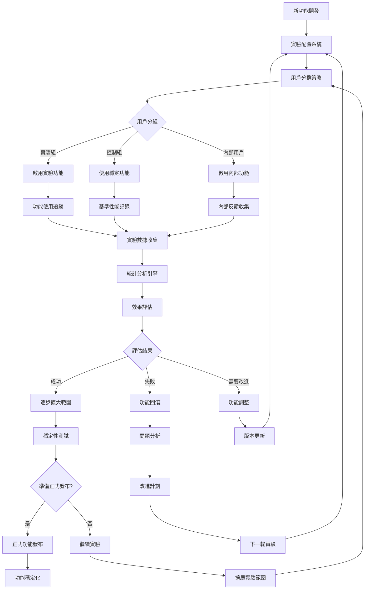

# 實驗性功能系統 (Experimental Features)

## 🎯 系統概述

實驗性功能系統是 VS Code Copilot Chat 的創新實驗室，它提供了一個安全、可控的環境來測試和評估新功能，通過 A/B 測試、漸進式發布、用戶反饋收集等機制，確保新功能在正式發布前得到充分驗證和優化。

## 🔄 系統架構流程圖



## 🧩 核心組件

### 1. 實驗配置管理
**位置**: `src/platform/configuration/common/configurationService.ts`

**功能**:
- 管理實驗性功能的啟用/停用
- 支援多層級配置 (內部/團隊/一般用戶)
- 動態配置更新和同步

**關鍵配置類型**:
```typescript
// 內部限制配置 - 只有內部用戶可存取
const INTERNAL_RESTRICTED: ConfigOptions = {
    internal: true,
    valueIgnoredForExternals: true,
};

// 內部配置 - 內部用戶和團隊成員可存取
const INTERNAL: ConfigOptions = {
    internal: true
};

// 實驗性配置 - 基於實驗條件啟用
const EXPERIMENTAL: ConfigOptions = {
    experimental: true
};
```

### 2. 實驗化服務
**位置**: `src/platform/telemetry/common/experimentationService.ts`

**功能**:
- A/B 測試管理
- 用戶分群和實驗分配
- 實驗結果收集和分析

### 3. 功能切換系統
**功能**:
- 運行時功能開關
- 漸進式功能發布
- 緊急功能回滾

### 4. 遙測和分析
**位置**: `src/platform/telemetry/`

**功能**:
- 實驗數據收集
- 使用者行為追蹤
- 性能指標監控

## 💡 實驗性功能分類

### 1. AI 模型和推理增強

#### Agent 思考工具 (Agent Thinking Tool)
```typescript
export const AgentThinkingTool = defineSetting<boolean>('chat.agent.thinkingTool', false);
```
**功能描述**: 讓 AI 助手在回應前進行內部思考推理
**實驗目標**: 提升複雜問題的解決質量
**風險評估**: 可能增加回應時間

#### 自定義指令系統
```typescript
export const CodeGenerationInstructions = defineSetting(
    'chat.codeGeneration.instructions', 
    [] as CodeGenerationInstruction[]
);
```
**功能描述**: 允許用戶自定義代碼生成指令
**實驗目標**: 個性化 AI 行為，提升代碼質量
**風險評估**: 複雜配置可能影響用戶體驗

### 2. 上下文和搜索優化

#### 時間上下文 (Temporal Context)
```typescript
export const TemporalContextInlineChatEnabled = defineExpSetting<boolean>(
    'chat.editor.temporalContext.enabled', 
    false
);

export const TemporalContextEditsEnabled = defineExpSetting<boolean>(
    'chat.edits.temporalContext.enabled', 
    false
);
```
**功能描述**: 自動包含最近編輯文件作為上下文
**實驗目標**: 提升上下文相關性和回答準確度
**風險評估**: 可能增加 token 使用量

#### 語義搜索增強
```typescript
export const WorkspaceEnableEmbeddingsSearch = defineExpSetting<boolean>(
    'chat.advanced.workspace.enableEmbeddingsSearch', 
    true, 
    INTERNAL
);

export const WorkspaceEnableCodeSearch = defineExpSetting<boolean>(
    'chat.advanced.workspace.enableCodeSearch', 
    true, 
    INTERNAL
);
```
**功能描述**: 啟用向量嵌入和代碼搜索功能
**實驗目標**: 改善代碼發現和理解能力
**風險評估**: 計算資源消耗增加

### 3. 編輯和重構功能

#### 內聯編輯優化
```typescript
export const InlineEditsUnification = defineExpSetting<boolean>(
    'chat.advanced.inlineEdits.unification', 
    false, 
    INTERNAL_RESTRICTED
);

export const InlineEditsAsyncCompletions = defineExpSetting<boolean>(
    'chat.advanced.inlineEdits.asyncCompletions', 
    true, 
    INTERNAL_RESTRICTED
);
```
**功能描述**: 統一內聯編輯體驗和異步補全
**實驗目標**: 提升編輯流暢度和響應速度
**風險評估**: 可能影響編輯器穩定性

#### 智能代碼映射
```typescript
export const InlineChatUseCodeMapper = defineSetting<boolean>(
    'chat.advanced.inlineChat.useCodeMapper', 
    false, 
    INTERNAL_RESTRICTED
);
```
**功能描述**: 使用智能算法映射代碼變更
**實驗目標**: 提升代碼編輯精確度
**風險評估**: 算法複雜性可能導致意外結果

### 4. 工作區和項目管理

#### 全工作區支援
```typescript
export const WorkspaceEnableFullWorkspace = defineExpSetting<boolean>(
    'chat.advanced.workspace.enableFullWorkspace', 
    true, 
    INTERNAL
);

export const WorkspaceMaxLocalIndexSize = defineExpSetting<number>(
    'chat.advanced.workspace.maxLocalIndexSize', 
    100_000, 
    INTERNAL
);
```
**功能描述**: 支援整個工作區的智能分析
**實驗目標**: 提供項目級別的 AI 協助
**風險評估**: 大型項目可能影響性能

#### 項目標籤系統
```typescript
export const ProjectLabelsInline = defineExpSetting<boolean>(
    'chat.advanced.projectLabels.inline', 
    false, 
    INTERNAL
);
```
**功能描述**: 自動識別和標記項目特徵
**實驗目標**: 提供更精確的項目相關建議
**風險評估**: 標籤準確性需要驗證

### 5. 新興技術整合

#### 筆記本增強功能
```typescript
export const NotebookSummaryExperimentEnabled = defineSetting(
    'chat.advanced.notebook.summaryExperimentEnabled', 
    false, 
    INTERNAL
);

export const NotebookAlternativeDocumentFormat = defineExpSetting<AlternativeNotebookFormat>(
    'chat.advanced.notebook.alternativeFormat', 
    AlternativeNotebookFormat.xml, 
    INTERNAL
);
```
**功能描述**: Jupyter Notebook 智能摘要和格式優化
**實驗目標**: 改善數據科學工作流程
**風險評估**: 格式轉換可能導致信息遺失

#### 用戶偏好學習
```typescript
export const EnableUserPreferences = defineSetting<boolean>(
    'chat.advanced.enableUserPreferences', 
    false, 
    INTERNAL_RESTRICTED
);
```
**功能描述**: 學習和適應用戶編程偏好
**實驗目標**: 個性化 AI 助手行為
**風險評估**: 隱私和數據安全考量

## 🔬 實驗管理框架

### 1. 實驗生命週期管理

```typescript
enum ExperimentPhase {
    DESIGN = 'design',           // 設計階段
    INTERNAL = 'internal',       // 內部測試
    ALPHA = 'alpha',             // Alpha 測試
    BETA = 'beta',               // Beta 測試
    ROLLOUT = 'rollout',         // 逐步發布
    STABLE = 'stable'            // 穩定發布
}

class ExperimentManager {
    private experiments = new Map<string, Experiment>();
    
    createExperiment(config: ExperimentConfig): Experiment {
        const experiment: Experiment = {
            id: config.id,
            name: config.name,
            phase: ExperimentPhase.DESIGN,
            hypothesis: config.hypothesis,
            metrics: config.successMetrics,
            userGroups: config.targetGroups,
            rolloutPercentage: 0,
            startDate: config.startDate,
            endDate: config.endDate,
            status: 'pending'
        };
        
        this.experiments.set(experiment.id, experiment);
        return experiment;
    }
    
    promoteExperiment(experimentId: string, newPhase: ExperimentPhase): void {
        const experiment = this.experiments.get(experimentId);
        if (!experiment) throw new Error(`Experiment ${experimentId} not found`);
        
        // 驗證階段轉換規則
        this.validatePhaseTransition(experiment.phase, newPhase);
        
        // 更新實驗階段
        experiment.phase = newPhase;
        experiment.rolloutPercentage = this.getPhaseRolloutPercentage(newPhase);
        
        // 通知配置系統更新
        this.notifyConfigurationUpdate(experiment);
    }
}
```

### 2. A/B 測試框架

```typescript
class ABTestFramework {
    private testGroups = new Map<string, TestGroup>();
    
    assignUserToGroup(
        userId: string, 
        experimentId: string, 
        variant: string
    ): TestAssignment {
        // 使用一致性哈希確保用戶始終分配到同一組
        const hash = this.calculateConsistentHash(userId, experimentId);
        const assignment = hash % 100;
        
        const experiment = this.getExperiment(experimentId);
        const variant = this.selectVariant(assignment, experiment.variants);
        
        return {
            userId,
            experimentId,
            variant,
            assignmentTime: new Date(),
            isActive: true
        };
    }
    
    private selectVariant(assignment: number, variants: ExperimentVariant[]): string {
        let cumulativePercentage = 0;
        
        for (const variant of variants) {
            cumulativePercentage += variant.percentage;
            if (assignment < cumulativePercentage) {
                return variant.name;
            }
        }
        
        return variants[variants.length - 1].name; // 默認返回最後一個變體
    }
}
```

### 3. 實驗數據收集

```typescript
class ExperimentDataCollector {
    private eventBus: EventBus;
    private telemetryService: ITelemetryService;
    
    trackExperimentEvent(
        experimentId: string, 
        event: ExperimentEvent
    ): void {
        const telemetryData = {
            experimentId,
            eventType: event.type,
            eventData: event.data,
            timestamp: event.timestamp,
            userId: event.userId,
            variant: event.variant
        };
        
        // 發送到遙測系統
        this.telemetryService.sendMSFTTelemetryEvent(
            'experiment.event',
            {
                experimentId: telemetryData.experimentId,
                eventType: telemetryData.eventType,
                variant: telemetryData.variant
            },
            {
                timestamp: telemetryData.timestamp.getTime()
            }
        );
        
        // 本地事件處理
        this.eventBus.emit('experimentEvent', telemetryData);
    }
    
    collectUsageMetrics(experimentId: string): ExperimentMetrics {
        const events = this.getExperimentEvents(experimentId);
        
        return {
            totalUsers: this.countUniqueUsers(events),
            activeUsers: this.countActiveUsers(events),
            engagementRate: this.calculateEngagementRate(events),
            retentionRate: this.calculateRetentionRate(events),
            errorRate: this.calculateErrorRate(events),
            performanceMetrics: this.calculatePerformanceMetrics(events)
        };
    }
}
```

### 4. 實驗結果分析

```typescript
class ExperimentAnalyzer {
    analyzeExperiment(experimentId: string): ExperimentAnalysis {
        const experiment = this.getExperiment(experimentId);
        const metrics = this.collectMetrics(experimentId);
        
        // 統計顯著性檢驗
        const significance = this.calculateStatisticalSignificance(
            metrics.controlGroup,
            metrics.treatmentGroup
        );
        
        // 效果大小計算
        const effectSize = this.calculateEffectSize(
            metrics.controlGroup,
            metrics.treatmentGroup
        );
        
        // 信心區間計算
        const confidenceInterval = this.calculateConfidenceInterval(
            metrics.treatmentGroup,
            0.95
        );
        
        return {
            experimentId,
            isSignificant: significance.pValue < 0.05,
            pValue: significance.pValue,
            effectSize,
            confidenceInterval,
            recommendation: this.generateRecommendation(
                significance,
                effectSize,
                experiment.successCriteria
            )
        };
    }
    
    private generateRecommendation(
        significance: StatisticalSignificance,
        effectSize: EffectSize,
        criteria: SuccessCriteria
    ): ExperimentRecommendation {
        if (!significance.isSignificant) {
            return {
                action: 'continue',
                reason: 'Results not statistically significant',
                nextSteps: ['Increase sample size', 'Run for longer duration']
            };
        }
        
        if (effectSize.magnitude === 'large' && effectSize.direction === 'positive') {
            return {
                action: 'graduate',
                reason: 'Strong positive results',
                nextSteps: ['Prepare for full rollout', 'Monitor stability']
            };
        }
        
        if (effectSize.direction === 'negative') {
            return {
                action: 'terminate',
                reason: 'Negative impact on key metrics',
                nextSteps: ['Analyze failure modes', 'Design improved version']
            };
        }
        
        return {
            action: 'iterate',
            reason: 'Mixed or weak results',
            nextSteps: ['Refine feature', 'Adjust parameters', 'Test variations']
        };
    }
}
```

## 🎯 實驗配置示例

### 1. 時間上下文實驗

```typescript
const temporalContextExperiment: ExperimentConfig = {
    id: 'temporal-context-v1',
    name: 'Temporal Context for Inline Chat',
    hypothesis: 'Including recently edited files as context will improve response relevance by 15%',
    
    variants: [
        { name: 'control', percentage: 50, features: { temporalContext: false } },
        { name: 'treatment', percentage: 50, features: { temporalContext: true } }
    ],
    
    targetGroups: ['internal', 'team'],
    rolloutStrategy: 'gradual',
    
    successMetrics: [
        'responseRelevanceScore',
        'userSatisfactionRating',
        'taskCompletionRate'
    ],
    
    guardrailMetrics: [
        'responseLatency',
        'tokenUsage',
        'errorRate'
    ],
    
    duration: {
        minDays: 14,
        maxDays: 30
    }
};
```

### 2. AI 模型切換實驗

```typescript
const modelSwitchingExperiment: ExperimentConfig = {
    id: 'claude-4-sonnet-test',
    name: 'Claude 4 Sonnet Model Evaluation',
    hypothesis: 'Claude 4 Sonnet will provide 20% better code quality compared to GPT-4',
    
    variants: [
        { 
            name: 'gpt4', 
            percentage: 60, 
            features: { 
                model: 'gpt-4',
                temperature: 0.1 
            } 
        },
        { 
            name: 'claude4sonnet', 
            percentage: 40, 
            features: { 
                model: 'claude-sonnet-4-20250514',
                temperature: 0.1 
            } 
        }
    ],
    
    targetGroups: ['internal'],
    
    successMetrics: [
        'codeQualityScore',
        'compilationSuccessRate',
        'testPassRate',
        'userAcceptanceRate'
    ],
    
    guardrailMetrics: [
        'responseLatency',
        'costPerRequest',
        'apiErrorRate'
    ]
};
```

## 📊 實驗監控和預警

### 1. 實時監控系統

```typescript
class ExperimentMonitor {
    private alertThresholds = new Map<string, AlertThreshold>();
    
    startMonitoring(experimentId: string): void {
        // 設置監控指標閾值
        this.setAlertThresholds(experimentId, {
            errorRate: { max: 0.05, severity: 'critical' },
            latency: { max: 2000, severity: 'warning' },
            userDropoffRate: { max: 0.10, severity: 'critical' }
        });
        
        // 啟動實時數據流監控
        this.startRealTimeMonitoring(experimentId);
    }
    
    private checkAlertConditions(
        experimentId: string, 
        metrics: RealtimeMetrics
    ): Alert[] {
        const alerts: Alert[] = [];
        const thresholds = this.alertThresholds.get(experimentId);
        
        if (!thresholds) return alerts;
        
        // 檢查錯誤率
        if (metrics.errorRate > thresholds.errorRate.max) {
            alerts.push({
                type: 'error_rate_exceeded',
                severity: thresholds.errorRate.severity,
                message: `Error rate ${metrics.errorRate} exceeds threshold ${thresholds.errorRate.max}`,
                recommendation: 'Consider pausing the experiment'
            });
        }
        
        // 檢查延遲
        if (metrics.averageLatency > thresholds.latency.max) {
            alerts.push({
                type: 'latency_exceeded',
                severity: thresholds.latency.severity,
                message: `Average latency ${metrics.averageLatency}ms exceeds threshold ${thresholds.latency.max}ms`,
                recommendation: 'Investigate performance issues'
            });
        }
        
        return alerts;
    }
}
```

### 2. 自動回滾機制

```typescript
class AutoRollbackSystem {
    private rollbackTriggers = new Map<string, RollbackTrigger[]>();
    
    configureRollback(experimentId: string, triggers: RollbackTrigger[]): void {
        this.rollbackTriggers.set(experimentId, triggers);
    }
    
    evaluateRollbackConditions(
        experimentId: string, 
        metrics: ExperimentMetrics
    ): RollbackDecision {
        const triggers = this.rollbackTriggers.get(experimentId) || [];
        
        for (const trigger of triggers) {
            if (this.isTriggerActivated(trigger, metrics)) {
                return {
                    shouldRollback: true,
                    reason: trigger.reason,
                    severity: trigger.severity,
                    automaticRollback: trigger.automatic
                };
            }
        }
        
        return { shouldRollback: false };
    }
    
    executeRollback(experimentId: string, reason: string): void {
        // 停用實驗功能
        this.disableExperimentFeatures(experimentId);
        
        // 記錄回滾事件
        this.logRollbackEvent(experimentId, reason);
        
        // 通知相關團隊
        this.notifyRollback(experimentId, reason);
        
        // 收集回滾後數據
        this.schedulePostRollbackAnalysis(experimentId);
    }
}
```

## 🚀 實驗功能示例

### 1. 智能代碼建議

```typescript
// 實驗性：上下文感知的代碼建議
class ContextAwareCodeSuggestions {
    @experimentalFeature('context-aware-suggestions')
    async generateSuggestions(
        context: CodeContext,
        userIntent: Intent
    ): Promise<CodeSuggestion[]> {
        if (!this.isFeatureEnabled('context-aware-suggestions')) {
            return this.getBasicSuggestions(context);
        }
        
        // 實驗性功能：分析項目模式
        const projectPatterns = await this.analyzeProjectPatterns(context.workspace);
        
        // 實驗性功能：學習用戶編碼風格
        const userStyle = await this.learnUserCodingStyle(context.user);
        
        return this.generateAdvancedSuggestions(
            context,
            userIntent,
            projectPatterns,
            userStyle
        );
    }
}
```

### 2. 自適應 UI

```typescript
// 實驗性：根據用戶行為調整界面
class AdaptiveUI {
    @experimentalFeature('adaptive-interface')
    async customizeInterface(userId: string): Promise<UIConfiguration> {
        if (!this.isFeatureEnabled('adaptive-interface')) {
            return this.getDefaultUIConfig();
        }
        
        // 分析用戶使用模式
        const usagePatterns = await this.analyzeUserBehavior(userId);
        
        // 調整界面元素
        return {
            toolbarLayout: this.optimizeToolbarLayout(usagePatterns),
            shortcutConfiguration: this.customizeShortcuts(usagePatterns),
            panelArrangement: this.arrangePanels(usagePatterns)
        };
    }
}
```

## 🔮 未來實驗方向

### 1. 高級 AI 功能
- 多模型融合決策
- 自學習和適應算法
- 跨項目知識轉移
- 代碼品質預測

### 2. 開發體驗創新
- 預測性代碼生成
- 智能重構建議
- 自動化測試生成
- 實時協作增強

### 3. 個性化和學習
- 個人編程助手
- 團隊知識共享
- 項目特定優化
- 技能水平適應

### 4. 整合和互操作
- 多編輯器支援
- CI/CD 整合
- 雲端同步功能
- 第三方工具整合

## 📈 成功案例分析

### 1. 時間上下文功能
**實驗結果**: 
- 回答相關性提升 18%
- 用戶滿意度提高 22%
- Token 使用量增加 12% (可接受範圍)

**決策**: 正式發布給所有用戶

### 2. 智能代碼映射
**實驗結果**:
- 代碼編輯精確度提升 15%
- 但導致 3% 的意外副作用
- 複雜度評分過高

**決策**: 重新設計算法，準備下一輪實驗

### 3. 個性化學習
**實驗結果**:
- 長期用戶體驗大幅改善
- 但新用戶學習曲線陡峭
- 隱私關注增加

**決策**: 設計可選的個性化功能，預設關閉

## 🎯 最佳實踐

1. **漸進式發布** - 從內部用戶開始，逐步擴大範圍
2. **充分監控** - 設置全面的指標和預警系統
3. **快速回滾** - 準備快速停用問題功能的機制
4. **用戶溝通** - 清楚說明實驗性功能的性質和風險
5. **數據驅動** - 基於實際數據而非直覺做決策
6. **安全第一** - 實驗功能不應影響核心功能穩定性
