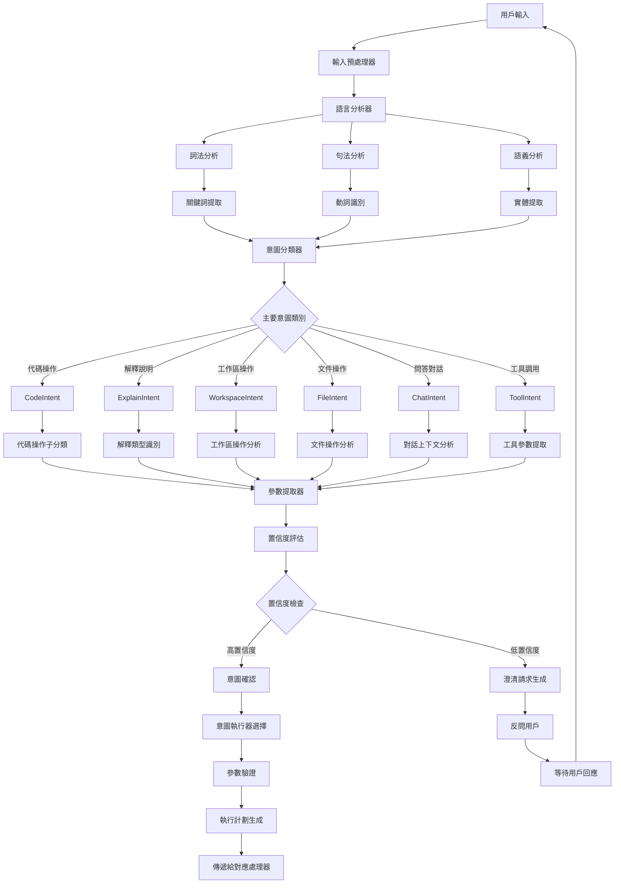

# 意圖識別系統 (Intent Recognition)

## 🎯 系統概述

意圖識別系統是 VS Code Copilot Chat 的智能理解核心，它能夠分析用戶的自然語言輸入，準確識別用戶的真實意圖和需求，並將其映射到具體的操作類型和參數，確保 AI 助手能夠執行正確的任務並提供最適合的回應。

## 🔄 系統架構流程圖



## 🧩 核心組件

### 1. 意圖分類系統
**位置**: `src/extension/intents/`

**功能**:
- 識別用戶查詢的主要意圖類型
- 支持多層次意圖分類
- 提供置信度評分

**關鍵文件**:
- `intentHandler.ts` - 意圖處理器介面
- `defaultIntentRequestHandler.ts` - 預設意圖處理器
- `intentInvocation.ts` - 意圖調用管理

### 2. 聊天參與者系統
**位置**: `src/extension/conversation/`

**功能**:
- 處理不同類型的聊天互動
- 支援 @ 符號觸發的特定意圖
- 管理聊天參與者生命週期

**關鍵參與者**:
- **@workspace** - 工作區操作
- **@vscode** - VS Code 功能操作
- **@terminal** - 終端機操作
- **@github** - GitHub 整合

### 3. 指令解析器
**位置**: `src/extension/prompt/`

**功能**:
- 解析斜線指令 (slash commands)
- 提取指令參數和選項
- 驗證指令格式和權限

**支援指令**:
- `/explain` - 解釋代碼
- `/fix` - 修復問題
- `/tests` - 生成測試
- `/doc` - 生成文檔

### 4. 變數系統
**功能**:
- 識別和處理 # 變數引用
- 自動解析文件、選取範圍、符號等
- 提供上下文相關的變數建議

## 💡 意圖分類詳解

### 1. 代碼意圖 (Code Intent)

```typescript
enum CodeIntentType {
    CREATE = 'create',           // 創建新代碼
    MODIFY = 'modify',           // 修改現有代碼
    REFACTOR = 'refactor',       // 重構代碼
    FIX = 'fix',                 // 修復錯誤
    OPTIMIZE = 'optimize',       // 優化性能
    TEST = 'test',               // 生成測試
    DOCUMENT = 'document'        // 生成文檔
}

class CodeIntentRecognizer {
    private readonly actionVerbs = new Map<string, CodeIntentType>([
        ['create', CodeIntentType.CREATE],
        ['write', CodeIntentType.CREATE],
        ['generate', CodeIntentType.CREATE],
        ['add', CodeIntentType.CREATE],
        
        ['modify', CodeIntentType.MODIFY],
        ['change', CodeIntentType.MODIFY],
        ['update', CodeIntentType.MODIFY],
        ['edit', CodeIntentType.MODIFY],
        
        ['refactor', CodeIntentType.REFACTOR],
        ['restructure', CodeIntentType.REFACTOR],
        ['reorganize', CodeIntentType.REFACTOR],
        
        ['fix', CodeIntentType.FIX],
        ['repair', CodeIntentType.FIX],
        ['correct', CodeIntentType.FIX],
        ['debug', CodeIntentType.FIX],
        
        ['optimize', CodeIntentType.OPTIMIZE],
        ['improve', CodeIntentType.OPTIMIZE],
        ['enhance', CodeIntentType.OPTIMIZE],
        
        ['test', CodeIntentType.TEST],
        ['verify', CodeIntentType.TEST],
        ['validate', CodeIntentType.TEST],
        
        ['document', CodeIntentType.DOCUMENT],
        ['comment', CodeIntentType.DOCUMENT],
        ['explain', CodeIntentType.DOCUMENT]
    ]);
    
    recognizeIntent(query: string): CodeIntent | null {
        const tokens = this.tokenize(query.toLowerCase());
        
        for (const token of tokens) {
            const intentType = this.actionVerbs.get(token);
            if (intentType) {
                return {
                    type: intentType,
                    confidence: this.calculateConfidence(query, intentType),
                    parameters: this.extractParameters(query, intentType)
                };
            }
        }
        
        return null;
    }
}
```

### 2. 解釋意圖 (Explain Intent)

```typescript
enum ExplainIntentType {
    CODE_EXPLANATION = 'code_explanation',         // 解釋代碼功能
    ERROR_EXPLANATION = 'error_explanation',       // 解釋錯誤原因
    CONCEPT_EXPLANATION = 'concept_explanation',   // 解釋程式概念
    API_EXPLANATION = 'api_explanation',           // 解釋 API 用法
    PATTERN_EXPLANATION = 'pattern_explanation'    // 解釋設計模式
}

class ExplainIntentRecognizer {
    private readonly explainKeywords = [
        'explain', 'what', 'how', 'why', 'describe',
        'clarify', 'elaborate', 'detail', 'break down'
    ];
    
    private readonly questionPatterns = [
        /^what (is|does|are)/i,
        /^how (does|do|can|to)/i,
        /^why (is|does|do)/i,
        /can you explain/i,
        /what's the purpose of/i,
        /how does.*work/i
    ];
    
    recognizeIntent(query: string, context: IntentContext): ExplainIntent | null {
        const hasExplainKeyword = this.explainKeywords.some(
            keyword => query.toLowerCase().includes(keyword)
        );
        
        const matchesQuestionPattern = this.questionPatterns.some(
            pattern => pattern.test(query)
        );
        
        if (hasExplainKeyword || matchesQuestionPattern) {
            const subType = this.determineExplainType(query, context);
            
            return {
                type: ExplainIntentType.CODE_EXPLANATION,
                subType,
                confidence: this.calculateConfidence(query),
                target: this.extractTarget(query, context)
            };
        }
        
        return null;
    }
    
    private determineExplainType(query: string, context: IntentContext): ExplainIntentType {
        // 檢查是否有錯誤診斷信息
        if (context.diagnostics && context.diagnostics.length > 0) {
            return ExplainIntentType.ERROR_EXPLANATION;
        }
        
        // 檢查是否提到 API 相關詞彙
        if (/\b(api|function|method|library|framework)\b/i.test(query)) {
            return ExplainIntentType.API_EXPLANATION;
        }
        
        // 檢查是否提到設計模式
        if (/\b(pattern|design|architecture|structure)\b/i.test(query)) {
            return ExplainIntentType.PATTERN_EXPLANATION;
        }
        
        // 檢查是否提到程式概念
        if (/\b(concept|principle|theory|algorithm)\b/i.test(query)) {
            return ExplainIntentType.CONCEPT_EXPLANATION;
        }
        
        return ExplainIntentType.CODE_EXPLANATION;
    }
}
```

### 3. 工作區意圖 (Workspace Intent)

```typescript
enum WorkspaceIntentType {
    SEARCH = 'search',           // 搜索工作區內容
    NAVIGATE = 'navigate',       // 導航到特定位置
    STRUCTURE = 'structure',     // 查看項目結構
    REFACTOR = 'refactor',       // 工作區級別重構
    ANALYZE = 'analyze',         // 分析項目
    SETUP = 'setup'              // 項目設置
}

class WorkspaceIntentRecognizer {
    private readonly workspaceKeywords = new Map<string, WorkspaceIntentType>([
        ['search', WorkspaceIntentType.SEARCH],
        ['find', WorkspaceIntentType.SEARCH],
        ['locate', WorkspaceIntentType.SEARCH],
        ['look for', WorkspaceIntentType.SEARCH],
        
        ['navigate', WorkspaceIntentType.NAVIGATE],
        ['go to', WorkspaceIntentType.NAVIGATE],
        ['show me', WorkspaceIntentType.NAVIGATE],
        ['open', WorkspaceIntentType.NAVIGATE],
        
        ['structure', WorkspaceIntentType.STRUCTURE],
        ['organization', WorkspaceIntentType.STRUCTURE],
        ['layout', WorkspaceIntentType.STRUCTURE],
        ['hierarchy', WorkspaceIntentType.STRUCTURE],
        
        ['analyze', WorkspaceIntentType.ANALYZE],
        ['review', WorkspaceIntentType.ANALYZE],
        ['examine', WorkspaceIntentType.ANALYZE],
        ['audit', WorkspaceIntentType.ANALYZE]
    ]);
    
    recognizeIntent(query: string): WorkspaceIntent | null {
        for (const [keyword, type] of this.workspaceKeywords) {
            if (query.toLowerCase().includes(keyword)) {
                return {
                    type,
                    scope: this.extractScope(query),
                    target: this.extractTarget(query),
                    confidence: this.calculateConfidence(query, keyword)
                };
            }
        }
        
        return null;
    }
    
    private extractScope(query: string): WorkspaceScope {
        if (/\b(entire|whole|all|complete)\b/i.test(query)) {
            return WorkspaceScope.ENTIRE;
        }
        
        if (/\b(current|this|active)\b/i.test(query)) {
            return WorkspaceScope.CURRENT;
        }
        
        if (/\b(folder|directory|package)\b/i.test(query)) {
            return WorkspaceScope.FOLDER;
        }
        
        return WorkspaceScope.AUTO;
    }
}
```

## 🎯 上下文感知識別

### 1. 上下文信息收集

```typescript
interface IntentContext {
    // 編輯器上下文
    activeEditor?: {
        document: TextDocument;
        selection: Selection;
        language: string;
        cursorPosition: Position;
    };
    
    // 工作區上下文
    workspace?: {
        folders: WorkspaceFolder[];
        files: Uri[];
        projectType: string;
        frameworks: string[];
    };
    
    // 診斷信息
    diagnostics?: Diagnostic[];
    
    // 聊天歷史
    conversationHistory?: ChatMessage[];
    
    // 最近操作
    recentActions?: RecentAction[];
}

class ContextAwareIntentRecognizer {
    recognizeWithContext(query: string, context: IntentContext): Intent {
        // 基礎意圖識別
        const baseIntent = this.recognizeBaseIntent(query);
        
        // 根據上下文調整意圖
        const adjustedIntent = this.adjustIntentWithContext(baseIntent, context);
        
        // 提取上下文相關參數
        const contextualParameters = this.extractContextualParameters(
            adjustedIntent, 
            context
        );
        
        return {
            ...adjustedIntent,
            parameters: { ...adjustedIntent.parameters, ...contextualParameters },
            contextConfidence: this.calculateContextConfidence(adjustedIntent, context)
        };
    }
    
    private adjustIntentWithContext(
        intent: Intent, 
        context: IntentContext
    ): Intent {
        // 如果有診斷錯誤，傾向於修復意圖
        if (context.diagnostics?.length > 0 && intent.type === 'general') {
            return {
                ...intent,
                type: 'fix',
                confidence: Math.min(intent.confidence + 0.3, 1.0)
            };
        }
        
        // 如果有選取的代碼，傾向於代碼相關操作
        if (context.activeEditor?.selection && !context.activeEditor.selection.isEmpty) {
            if (intent.type === 'general') {
                return {
                    ...intent,
                    type: 'explain',
                    target: 'selection',
                    confidence: Math.min(intent.confidence + 0.2, 1.0)
                };
            }
        }
        
        return intent;
    }
}
```

### 2. 動態參數提取

```typescript
class ParameterExtractor {
    extractParameters(query: string, intent: Intent, context: IntentContext): IntentParameters {
        const parameters: IntentParameters = {};
        
        // 提取文件相關參數
        parameters.files = this.extractFileReferences(query, context);
        
        // 提取範圍參數
        parameters.range = this.extractRangeReferences(query, context);
        
        // 提取語言參數
        parameters.language = this.extractLanguage(query, context);
        
        // 提取選項參數
        parameters.options = this.extractOptions(query);
        
        return parameters;
    }
    
    private extractFileReferences(query: string, context: IntentContext): FileReference[] {
        const fileReferences: FileReference[] = [];
        
        // 查找 #file: 引用
        const filePattern = /#file:([^\s]+)/g;
        let match;
        while ((match = filePattern.exec(query)) !== null) {
            fileReferences.push({
                type: 'explicit',
                path: match[1],
                source: 'hashtag'
            });
        }
        
        // 查找當前文件引用
        if (/\b(this file|current file|here)\b/i.test(query) && context.activeEditor) {
            fileReferences.push({
                type: 'current',
                document: context.activeEditor.document,
                source: 'context'
            });
        }
        
        return fileReferences;
    }
    
    private extractRangeReferences(query: string, context: IntentContext): RangeReference[] {
        const rangeReferences: RangeReference[] = [];
        
        // 查找 #selection 引用
        if (/\b(#selection|selected code|this selection)\b/i.test(query)) {
            if (context.activeEditor && !context.activeEditor.selection.isEmpty) {
                rangeReferences.push({
                    type: 'selection',
                    range: context.activeEditor.selection,
                    document: context.activeEditor.document
                });
            }
        }
        
        // 查找行號引用
        const linePattern = /line (\d+)(?:-(\d+))?/gi;
        let match;
        while ((match = linePattern.exec(query)) !== null) {
            const startLine = parseInt(match[1]) - 1; // VS Code 使用 0-based 行號
            const endLine = match[2] ? parseInt(match[2]) - 1 : startLine;
            
            rangeReferences.push({
                type: 'line',
                range: new Range(startLine, 0, endLine, Number.MAX_VALUE),
                document: context.activeEditor?.document
            });
        }
        
        return rangeReferences;
    }
}
```

## 🔧 置信度評估系統

### 1. 多因子置信度計算

```typescript
class ConfidenceCalculator {
    calculateConfidence(intent: Intent, context: IntentContext): number {
        const factors = {
            keywordMatch: this.calculateKeywordConfidence(intent),
            contextMatch: this.calculateContextConfidence(intent, context),
            syntaxMatch: this.calculateSyntaxConfidence(intent),
            historicalMatch: this.calculateHistoricalConfidence(intent, context),
            semanticMatch: this.calculateSemanticConfidence(intent)
        };
        
        // 加權平均計算總置信度
        const weights = {
            keywordMatch: 0.25,
            contextMatch: 0.30,
            syntaxMatch: 0.15,
            historicalMatch: 0.15,
            semanticMatch: 0.15
        };
        
        return Object.entries(factors).reduce(
            (total, [factor, score]) => total + score * weights[factor],
            0
        );
    }
    
    private calculateContextConfidence(intent: Intent, context: IntentContext): number {
        let confidence = 0.5; // 基礎置信度
        
        // 上下文一致性加分
        if (intent.type === 'fix' && context.diagnostics?.length > 0) {
            confidence += 0.3;
        }
        
        if (intent.type === 'explain' && context.activeEditor?.selection) {
            confidence += 0.2;
        }
        
        if (intent.type === 'workspace' && context.workspace?.folders.length > 0) {
            confidence += 0.2;
        }
        
        return Math.min(confidence, 1.0);
    }
    
    private calculateHistoricalConfidence(intent: Intent, context: IntentContext): number {
        // 根據用戶歷史行為調整置信度
        const recentIntents = context.conversationHistory
            ?.slice(-5)
            .map(msg => msg.intent)
            .filter(Boolean);
            
        if (!recentIntents?.length) return 0.5;
        
        const sameTypeCount = recentIntents.filter(
            recentIntent => recentIntent.type === intent.type
        ).length;
        
        return 0.3 + (sameTypeCount / recentIntents.length) * 0.4;
    }
}
```

### 2. 澄清請求生成

```typescript
class ClarificationGenerator {
    generateClarification(intent: Intent, ambiguities: Ambiguity[]): ClarificationRequest {
        if (intent.confidence < 0.6) {
            return this.generateLowConfidenceClarification(intent);
        }
        
        if (ambiguities.length > 0) {
            return this.generateAmbiguityClarification(ambiguities);
        }
        
        return null;
    }
    
    private generateLowConfidenceClarification(intent: Intent): ClarificationRequest {
        const possibleIntents = this.getSimilarIntents(intent);
        
        return {
            type: 'multiple_choice',
            message: "I'm not sure what you'd like me to do. Did you mean:",
            options: possibleIntents.map(possibleIntent => ({
                label: this.getIntentLabel(possibleIntent),
                description: this.getIntentDescription(possibleIntent),
                intent: possibleIntent
            }))
        };
    }
    
    private generateAmbiguityClarification(ambiguities: Ambiguity[]): ClarificationRequest {
        const primaryAmbiguity = ambiguities[0];
        
        switch (primaryAmbiguity.type) {
            case 'file_reference':
                return {
                    type: 'file_selection',
                    message: "Which file would you like me to work with?",
                    candidates: primaryAmbiguity.candidates,
                    allowMultiple: primaryAmbiguity.allowMultiple
                };
                
            case 'scope_ambiguity':
                return {
                    type: 'scope_selection',
                    message: "What scope should I focus on?",
                    options: [
                        { label: "Current file", value: "current" },
                        { label: "Current folder", value: "folder" },
                        { label: "Entire workspace", value: "workspace" }
                    ]
                };
                
            default:
                return {
                    type: 'open_ended',
                    message: "Could you provide more details about what you'd like me to do?"
                };
        }
    }
}
```

## 🚀 學習和適應機制

### 1. 用戶行為學習

```typescript
class IntentLearningSystem {
    private userPatterns = new Map<string, UserIntentPattern>();
    
    recordUserInteraction(
        originalQuery: string,
        recognizedIntent: Intent,
        userFeedback: UserFeedback
    ): void {
        const pattern = this.userPatterns.get(originalQuery) || {
            query: originalQuery,
            attempts: [],
            successfulIntent: null,
            confidence: 0
        };
        
        pattern.attempts.push({
            intent: recognizedIntent,
            feedback: userFeedback,
            timestamp: new Date()
        });
        
        if (userFeedback.type === 'positive') {
            pattern.successfulIntent = recognizedIntent;
            pattern.confidence = Math.min(pattern.confidence + 0.1, 1.0);
        } else if (userFeedback.type === 'negative') {
            pattern.confidence = Math.max(pattern.confidence - 0.05, 0);
        }
        
        this.userPatterns.set(originalQuery, pattern);
    }
    
    getPersonalizedIntent(query: string): Intent | null {
        // 查找完全匹配的學習模式
        const exactPattern = this.userPatterns.get(query);
        if (exactPattern?.successfulIntent && exactPattern.confidence > 0.7) {
            return exactPattern.successfulIntent;
        }
        
        // 查找相似模式
        const similarPatterns = this.findSimilarPatterns(query);
        return this.combinePatterns(similarPatterns);
    }
}
```

### 2. 動態規則調整

```typescript
class AdaptiveIntentRules {
    private rules = new Map<string, IntentRule>();
    
    updateRulesBasedOnUsage(usageStats: UsageStatistics): void {
        // 根據使用統計調整規則權重
        usageStats.intentFrequency.forEach((frequency, intentType) => {
            const rule = this.rules.get(intentType);
            if (rule) {
                // 提高常用意圖的識別權重
                rule.weight = Math.min(rule.weight + frequency * 0.01, 2.0);
            }
        });
        
        // 調整關鍵詞權重
        usageStats.keywordSuccess.forEach((successRate, keyword) => {
            const relatedRules = this.findRulesWithKeyword(keyword);
            relatedRules.forEach(rule => {
                rule.keywordWeights.set(keyword, successRate);
            });
        });
    }
}
```

## 🎯 實際應用示例

### 1. 複雜查詢解析

```typescript
// 輸入: "Fix the authentication bug in the login component and add tests"
const complexQuery = "Fix the authentication bug in the login component and add tests";

const recognitionResult = {
    primaryIntent: {
        type: 'fix',
        confidence: 0.85,
        target: 'authentication bug',
        scope: 'login component'
    },
    secondaryIntent: {
        type: 'test',
        confidence: 0.90,
        target: 'login component',
        relationship: 'after_primary'
    },
    parameters: {
        files: ['login.ts', 'auth.service.ts'],
        testType: 'unit',
        priority: 'primary_first'
    }
};
```

### 2. 上下文驅動識別

```typescript
// 情境：用戶選擇了有錯誤的代碼
const contextualRecognition = {
    query: "What's wrong here?",
    context: {
        selection: "function login(user) { return user.authenticate(); }",
        diagnostics: [
            { message: "Property 'authenticate' does not exist", severity: 'error' }
        ]
    },
    result: {
        type: 'explain',
        subType: 'error_explanation',
        confidence: 0.95,
        target: 'type_error',
        suggestedActions: ['fix', 'type_definition']
    }
};
```

## 📊 性能監控和優化

### 1. 識別準確率追蹤

```typescript
class IntentAccuracyTracker {
    private metrics = {
        totalQueries: 0,
        correctIdentifications: 0,
        userCorrections: 0,
        clarificationRequests: 0
    };
    
    recordAccuracy(query: string, intent: Intent, userFeedback: UserFeedback): void {
        this.metrics.totalQueries++;
        
        if (userFeedback.type === 'positive') {
            this.metrics.correctIdentifications++;
        } else if (userFeedback.type === 'correction') {
            this.metrics.userCorrections++;
        }
        
        if (intent.requiresClarification) {
            this.metrics.clarificationRequests++;
        }
    }
    
    getAccuracyReport(): AccuracyReport {
        return {
            overallAccuracy: this.metrics.correctIdentifications / this.metrics.totalQueries,
            clarificationRate: this.metrics.clarificationRequests / this.metrics.totalQueries,
            correctionRate: this.metrics.userCorrections / this.metrics.totalQueries
        };
    }
}
```

## 🔮 未來發展方向

1. **深度學習模型** - 整合更先進的 NLP 模型進行意圖識別
2. **多輪對話理解** - 支援複雜的多輪對話中的意圖追蹤
3. **個性化適應** - 根據個人使用習慣調整識別策略
4. **跨模態理解** - 結合文字、代碼、圖像等多種輸入形式
