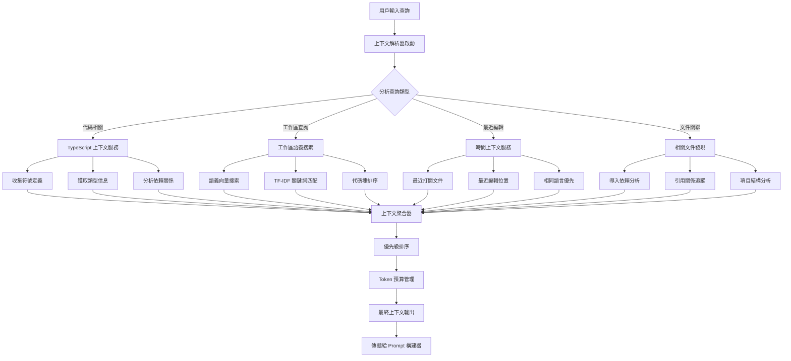

# 智能上下文收集系統 (Intelligent Context Resolution)

## 🎯 系統概述

智能上下文收集系統是 VS Code Copilot Chat 的核心功能之一，它能夠自動分析用戶的當前工作環境，收集相關的代碼、文件和項目信息，為 AI 模型提供豐富的上下文，從而生成更準確和有用的回答。

## 🔄 系統架構流程圖



## 🧩 核心組件

### 1. TypeScript 上下文服務
**位置**: `src/extension/typescriptContext/`

**功能**:
- 自動收集 TypeScript/JavaScript 符號定義
- 分析類型信息和依賴關係
- 提供智能代碼補全上下文

**關鍵文件**:
- `languageContextService.ts` - 主要上下文服務
- `contextProvider.ts` - 上下文提供者接口

### 2. 工作區語義搜索
**位置**: `src/extension/workspaceSemanticSearch/`

**功能**:
- 基於語義向量的代碼搜索
- 智能匹配相關代碼片段
- 支持自然語言查詢

**關鍵文件**:
- `semanticSearchTextSearchProvider.ts` - 語義搜索提供者
- `workspaceChunkEmbeddingsIndex.ts` - 向量索引

### 3. 時間上下文 (Temporal Context)
**位置**: `src/extension/prompts/node/inline/temporalContext.tsx`

**功能**:
- 追蹤最近打開和編輯的文件
- 根據時間順序提供相關上下文
- 優先考慮相同語言的文件

### 4. 相關文件發現
**位置**: `src/extension/relatedFiles/`

**功能**:
- 分析文件間的依賴關係
- 自動發現相關的源代碼文件
- 追蹤導入和引用關係

## 💡 工作原理

### 1. 查詢分析階段
系統首先分析用戶的查詢內容，確定需要收集哪些類型的上下文：

```typescript
// 查詢類型識別
interface QueryAnalysis {
    isCodeRelated: boolean;      // 是否與代碼相關
    isWorkspaceQuery: boolean;   // 是否為工作區查詢
    needsTypeInfo: boolean;      // 是否需要類型信息
    language: string;            // 主要程式語言
}
```

### 2. 並行上下文收集
系統會並行啟動多個上下文收集器：

```typescript
const contextPromises = [
    typeScriptContext.collect(query),
    semanticSearch.search(query),
    temporalContext.getRecentFiles(),
    relatedFiles.findRelated(currentFile)
];

const contexts = await Promise.all(contextPromises);
```

### 3. 優先級排序和過濾
收集到的上下文會根據相關性進行排序：

```typescript
interface ContextItem {
    content: string;
    relevanceScore: number;
    source: 'typescript' | 'semantic' | 'temporal' | 'related';
    priority: number;
}
```

### 4. Token 預算管理
系統會根據可用的 token 預算決定包含哪些上下文：

```typescript
const maxTokens = 32000; // 最大 token 限制
const prioritizedContext = sortByPriority(contexts);
const finalContext = fitWithinBudget(prioritizedContext, maxTokens);
```

## 🔧 配置選項

用戶可以通過以下設置來控制上下文收集行為：

```json
{
    "github.copilot.chat.editor.temporalContext.enabled": true,
    "github.copilot.chat.advanced.workspace.enableEmbeddingsSearch": true,
    "github.copilot.chat.advanced.workspace.maxLocalIndexSize": 100000,
    "github.copilot.chat.advanced.temporalContext.maxAge": 100,
    "github.copilot.chat.advanced.temporalContext.preferSameLang": true
}
```

## 🎯 實際應用場景

### 場景 1: 代碼解釋
當用戶選擇一段代碼並要求解釋時：
1. 收集選中代碼的類型定義
2. 找到相關的函數和類
3. 包含最近編輯的相關文件
4. 提供完整的代碼上下文

### 場景 2: 錯誤修復
當用戶報告錯誤時：
1. 分析錯誤診斷信息
2. 收集相關的類型定義
3. 找到類似的修復案例
4. 提供修復建議的上下文

### 場景 3: 功能實現
當用戶要求實現新功能時：
1. 分析項目結構
2. 找到相關的設計模式
3. 收集類似的實現案例
4. 提供實現指導的上下文

## 🚀 性能優化

### 1. 緩存機制
- 符號定義緩存
- 語義搜索結果緩存
- 文件關係緩存

### 2. 漸進式加載
- 優先加載高相關性內容
- 背景加載次要上下文
- 動態調整加載策略

### 3. 智能過濾
- 基於相關性得分過濾
- 去重複內容
- 語言特定過濾

## 📊 效果評估

智能上下文收集系統通過以下指標來評估效果：

1. **上下文相關性** - 收集的上下文與查詢的匹配度
2. **回答質量** - AI 回答的準確性和有用性
3. **響應時間** - 上下文收集的速度
4. **Token 使用效率** - 在有限 token 內的信息密度

## 🔮 未來發展

1. **學習用戶偏好** - 根據用戶行為調整上下文收集策略
2. **跨項目上下文** - 支持多個項目間的上下文關聯
3. **實時上下文更新** - 根據代碼變化實時更新上下文
4. **智能預測** - 預測用戶可能需要的上下文信息
