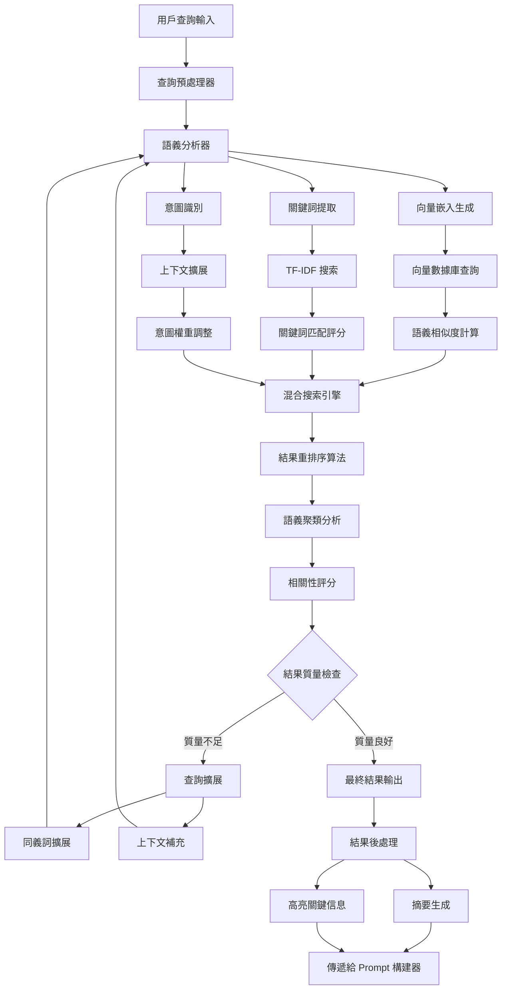

# 語義增強系統 (Semantic Enhancement)

## 🎯 系統概述

語義增強系統是 VS Code Copilot Chat 的智能搜索和理解核心，它使用先進的自然語言處理技術，包括向量嵌入、語義搜索和智能匹配算法，將用戶的自然語言查詢轉換為精確的代碼理解和相關內容發現，大幅提升 AI 助手的理解能力和回答準確性。

## 🔄 系統架構流程圖



## 🧩 核心組件

### 1. 向量嵌入引擎
**位置**: `src/platform/embedding/`

**功能**:
- 將代碼和文本轉換為高維向量表示
- 支持多種嵌入模型 (text-embedding-3-small 等)
- 實現語義相似度計算

**關鍵文件**:
- `embeddingProvider.ts` - 嵌入提供者接口
- `githubEmbeddingsComputer.ts` - GitHub 嵌入計算器

### 2. 語義搜索提供者
**位置**: `src/extension/workspaceSemanticSearch/`

**功能**:
- 實現 VS Code AI 文本搜索接口
- 提供自然語言代碼搜索能力
- 支持語義重排序和結果優化

**關鍵文件**:
- `semanticSearchTextSearchProvider.ts` - 主要搜索提供者
- `semanticSearchContribution.ts` - 搜索貢獻註冊

### 3. 工作區塊搜索系統
**位置**: `src/platform/workspaceChunkSearch/`

**功能**:
- 將大型文件分割為可搜索的代碼塊
- 實現混合搜索策略 (TF-IDF + 語義)
- 支持增量索引和快取優化

**關鍵文件**:
- `workspaceChunkSearchService.ts` - 搜索服務主控制器
- `workspaceChunkEmbeddingsIndex.ts` - 向量索引管理
- `tfidfWithSemanticChunkSearch.ts` - 混合搜索實現

### 4. 解析器服務
**位置**: `src/platform/parser/`

**功能**:
- 代碼語法分析和結構解析
- 提取代碼語義信息和符號關係
- 支持多種程式語言解析

## 💡 核心技術實現

### 1. 向量嵌入生成

```typescript
interface EmbeddingProvider {
    // 生成文本嵌入向量
    computeEmbedding(text: string): Promise<number[]>;
    
    // 批量生成嵌入向量
    computeEmbeddings(texts: string[]): Promise<number[][]>;
    
    // 計算向量相似度
    computeSimilarity(vector1: number[], vector2: number[]): number;
}

class GithubEmbeddingsComputer implements EmbeddingProvider {
    async computeEmbedding(text: string): Promise<number[]> {
        // 使用 GitHub/OpenAI API 生成嵌入向量
        const response = await this.apiClient.post('/embeddings', {
            model: 'text-embedding-3-small',
            input: text,
            dimensions: 1536
        });
        
        return response.data.embedding;
    }
}
```

### 2. 語義相似度計算

```typescript
class SemanticSimilarity {
    // 餘弦相似度計算
    cosineSimilarity(vectorA: number[], vectorB: number[]): number {
        const dotProduct = vectorA.reduce((sum, a, i) => sum + a * vectorB[i], 0);
        const magnitudeA = Math.sqrt(vectorA.reduce((sum, a) => sum + a * a, 0));
        const magnitudeB = Math.sqrt(vectorB.reduce((sum, b) => sum + b * b, 0));
        
        return dotProduct / (magnitudeA * magnitudeB);
    }
    
    // 歐幾里得距離
    euclideanDistance(vectorA: number[], vectorB: number[]): number {
        return Math.sqrt(
            vectorA.reduce((sum, a, i) => sum + Math.pow(a - vectorB[i], 2), 0)
        );
    }
}
```

### 3. 混合搜索策略

```typescript
class HybridSearchEngine {
    async search(
        query: string, 
        options: SearchOptions
    ): Promise<SearchResult[]> {
        // 並行執行多種搜索策略
        const [
            semanticResults,
            tfidfResults,
            symbolResults
        ] = await Promise.all([
            this.semanticSearch(query),      // 語義搜索
            this.tfidfSearch(query),         // 關鍵詞搜索  
            this.symbolSearch(query)         // 符號搜索
        ]);
        
        // 結果融合和重排序
        return this.fusionRanking([
            ...semanticResults,
            ...tfidfResults,
            ...symbolResults
        ]);
    }
    
    private fusionRanking(results: SearchResult[]): SearchResult[] {
        // 實現 RRF (Reciprocal Rank Fusion) 算法
        const fusionScores = new Map<string, number>();
        
        results.forEach((result, rank) => {
            const score = 1 / (rank + 60); // RRF 公式
            fusionScores.set(
                result.id, 
                (fusionScores.get(result.id) || 0) + score
            );
        });
        
        return Array.from(fusionScores.entries())
            .sort(([,scoreA], [,scoreB]) => scoreB - scoreA)
            .map(([id]) => results.find(r => r.id === id)!);
    }
}
```

### 4. 代碼塊智能分割

```typescript
class CodeChunker {
    chunkDocument(document: TextDocument): CodeChunk[] {
        const chunks: CodeChunk[] = [];
        const ast = this.parseDocument(document);
        
        // 按函數、類、模組等語義單位分割
        ast.functions.forEach(func => {
            chunks.push({
                content: func.text,
                range: func.range,
                type: 'function',
                symbolName: func.name,
                dependencies: this.extractDependencies(func)
            });
        });
        
        ast.classes.forEach(cls => {
            chunks.push({
                content: cls.text,
                range: cls.range,
                type: 'class',
                symbolName: cls.name,
                methods: cls.methods.map(m => m.name)
            });
        });
        
        return chunks;
    }
}
```

## 🔍 搜索策略詳解

### 1. TF-IDF 關鍵詞搜索

```typescript
class TfIdfSearch {
    private termFrequency = new Map<string, Map<string, number>>();
    private documentFrequency = new Map<string, number>();
    
    buildIndex(documents: Document[]): void {
        documents.forEach(doc => {
            const terms = this.tokenize(doc.content);
            const termCounts = new Map<string, number>();
            
            // 計算詞頻 (TF)
            terms.forEach(term => {
                termCounts.set(term, (termCounts.get(term) || 0) + 1);
            });
            
            // 記錄文檔頻率 (DF)
            Array.from(termCounts.keys()).forEach(term => {
                this.documentFrequency.set(
                    term, 
                    (this.documentFrequency.get(term) || 0) + 1
                );
            });
            
            this.termFrequency.set(doc.id, termCounts);
        });
    }
    
    search(query: string, topK: number = 10): SearchResult[] {
        const queryTerms = this.tokenize(query);
        const scores = new Map<string, number>();
        
        queryTerms.forEach(term => {
            this.termFrequency.forEach((docTerms, docId) => {
                if (docTerms.has(term)) {
                    const tf = docTerms.get(term)!;
                    const df = this.documentFrequency.get(term)!;
                    const idf = Math.log(this.termFrequency.size / df);
                    const tfidf = tf * idf;
                    
                    scores.set(docId, (scores.get(docId) || 0) + tfidf);
                }
            });
        });
        
        return Array.from(scores.entries())
            .sort(([,scoreA], [,scoreB]) => scoreB - scoreA)
            .slice(0, topK)
            .map(([docId, score]) => ({ docId, score }));
    }
}
```

### 2. 語義向量搜索

```typescript
class SemanticVectorSearch {
    private index: VectorIndex;
    
    async search(query: string, topK: number = 10): Promise<SearchResult[]> {
        // 生成查詢向量
        const queryVector = await this.embeddingProvider.computeEmbedding(query);
        
        // 在向量空間中搜索最相似的項目
        const candidates = await this.index.search(queryVector, topK * 2);
        
        // 語義相似度過濾和重排序
        const results = candidates
            .filter(candidate => candidate.similarity > 0.7) // 相似度閾值
            .sort((a, b) => b.similarity - a.similarity)
            .slice(0, topK);
            
        return results;
    }
}
```

### 3. 語義聚類分析

```typescript
class SemanticClustering {
    clusterResults(results: SearchResult[]): ClusterGroup[] {
        const vectors = results.map(r => r.embedding);
        const clusters = this.kMeansClustering(vectors, 3);
        
        return clusters.map(cluster => ({
            theme: this.extractTheme(cluster),
            results: cluster.map(idx => results[idx]),
            coherenceScore: this.calculateCoherence(cluster)
        }));
    }
    
    private extractTheme(cluster: number[]): string {
        // 從聚類中提取主題關鍵詞
        const texts = cluster.map(idx => this.results[idx].content);
        return this.extractKeywords(texts.join(' '));
    }
}
```

## 🎯 智能查詢擴展

### 1. 同義詞擴展

```typescript
class QueryExpansion {
    private synonyms = new Map<string, string[]>();
    
    expandQuery(originalQuery: string): string[] {
        const expandedQueries = [originalQuery];
        const terms = this.tokenize(originalQuery);
        
        terms.forEach(term => {
            const synonymList = this.synonyms.get(term);
            if (synonymList) {
                synonymList.forEach(synonym => {
                    const expandedQuery = originalQuery.replace(term, synonym);
                    expandedQueries.push(expandedQuery);
                });
            }
        });
        
        return expandedQueries;
    }
}
```

### 2. 上下文感知擴展

```typescript
class ContextAwareExpansion {
    expandWithContext(
        query: string, 
        context: WorkspaceContext
    ): ExpandedQuery {
        const expansion = {
            originalQuery: query,
            expandedTerms: [] as string[],
            contextualHints: [] as string[]
        };
        
        // 根據當前文件語言添加上下文
        if (context.currentLanguage) {
            expansion.expandedTerms.push(
                ...this.getLanguageSpecificTerms(context.currentLanguage)
            );
        }
        
        // 根據項目類型添加相關詞彙
        if (context.projectType) {
            expansion.contextualHints.push(
                ...this.getProjectTypeKeywords(context.projectType)
            );
        }
        
        return expansion;
    }
}
```

## 📊 結果評分和排序

### 1. 多維度評分系統

```typescript
interface ScoringDimensions {
    semanticSimilarity: number;    // 語義相似度 (0-1)
    keywordMatch: number;          // 關鍵詞匹配度 (0-1)
    contextRelevance: number;      // 上下文相關性 (0-1)
    recency: number;               // 時間新近性 (0-1)
    popularity: number;            // 使用頻率 (0-1)
}

class MultiDimensionalScoring {
    calculateFinalScore(
        result: SearchResult, 
        dimensions: ScoringDimensions,
        weights: ScoringWeights
    ): number {
        return (
            dimensions.semanticSimilarity * weights.semantic +
            dimensions.keywordMatch * weights.keyword +
            dimensions.contextRelevance * weights.context +
            dimensions.recency * weights.recency +
            dimensions.popularity * weights.popularity
        );
    }
}
```

### 2. 學習型排序優化

```typescript
class LearningToRank {
    private clickThroughData = new Map<string, number>();
    private userFeedback = new Map<string, number>();
    
    updateRanking(
        results: SearchResult[], 
        userInteraction: UserInteraction
    ): SearchResult[] {
        // 根據用戶點擊和反饋調整排序
        results.forEach(result => {
            const clickScore = this.clickThroughData.get(result.id) || 0;
            const feedbackScore = this.userFeedback.get(result.id) || 0;
            
            result.learningScore = (clickScore * 0.6) + (feedbackScore * 0.4);
        });
        
        return results.sort((a, b) => 
            (b.similarityScore + b.learningScore) - 
            (a.similarityScore + a.learningScore)
        );
    }
}
```

## 🚀 性能優化技術

### 1. 向量索引優化

```typescript
class OptimizedVectorIndex {
    private hierarchicalIndex: Map<number, VectorNode[]>;
    private approximateIndex: AnnoyIndex;
    
    constructor() {
        // 使用分層索引加速搜索
        this.hierarchicalIndex = new Map();
        
        // 使用近似最近鄰加速大規模搜索
        this.approximateIndex = new AnnoyIndex(1536, 'angular');
    }
    
    async search(queryVector: number[], topK: number): Promise<SearchResult[]> {
        // 首先使用近似索引快速過濾
        const candidates = this.approximateIndex.getNNsByVector(
            queryVector, 
            topK * 3
        );
        
        // 然後使用精確計算重排序
        const preciseResults = candidates.map(candidateId => {
            const candidateVector = this.getVector(candidateId);
            const similarity = this.cosineSimilarity(queryVector, candidateVector);
            return { id: candidateId, similarity };
        });
        
        return preciseResults
            .sort((a, b) => b.similarity - a.similarity)
            .slice(0, topK);
    }
}
```

### 2. 增量索引更新

```typescript
class IncrementalIndexing {
    private pendingUpdates = new Set<string>();
    private updateBatchSize = 100;
    
    async updateDocument(documentId: string, content: string): Promise<void> {
        this.pendingUpdates.add(documentId);
        
        // 批量處理更新以提高效率
        if (this.pendingUpdates.size >= this.updateBatchSize) {
            await this.processBatchUpdates();
        }
    }
    
    private async processBatchUpdates(): Promise<void> {
        const updates = Array.from(this.pendingUpdates);
        this.pendingUpdates.clear();
        
        // 並行處理多個文檔的嵌入計算
        const embeddings = await Promise.all(
            updates.map(docId => this.computeEmbedding(docId))
        );
        
        // 批量更新索引
        await this.index.batchUpdate(updates, embeddings);
    }
}
```

### 3. 智能快取策略

```typescript
class SemanticCache {
    private queryCache = new LRUCache<string, SearchResult[]>(1000);
    private embeddingCache = new LRUCache<string, number[]>(10000);
    
    async getCachedResults(query: string): Promise<SearchResult[] | null> {
        // 檢查完全匹配的快取
        const exactMatch = this.queryCache.get(query);
        if (exactMatch) return exactMatch;
        
        // 檢查語義相似的查詢快取
        const similarQueries = await this.findSimilarQueries(query);
        for (const similarQuery of similarQueries) {
            const cachedResults = this.queryCache.get(similarQuery.text);
            if (cachedResults && similarQuery.similarity > 0.9) {
                return cachedResults;
            }
        }
        
        return null;
    }
}
```

## 🎯 實際應用效果

### 1. 智能代碼搜索
- **自然語言查詢**: "Find functions that handle user authentication"
- **語義理解**: 系統理解 "authentication" 包含 login, signin, auth 等相關概念
- **上下文感知**: 根據當前項目類型調整搜索範圍

### 2. 相關性提升
- **傳統關鍵詞搜索**: 只能匹配確切的詞彙
- **語義增強搜索**: 理解概念和意圖，找到語義相關的內容
- **混合策略**: 結合精確匹配和語義理解的優勢

### 3. 結果質量改善
- **去重複**: 智能識別和合併相似的搜索結果
- **排序優化**: 多維度評分確保最相關的結果排在前面
- **聚類展示**: 將相關結果分組，幫助用戶快速理解

## 🔮 未來發展方向

1. **多模態理解** - 支持代碼、文檔、圖像等多種內容類型的語義搜索
2. **個性化學習** - 根據用戶行為和偏好調整語義理解模型
3. **實時更新** - 支持代碼變更的實時語義索引更新
4. **跨語言理解** - 支持多種程式語言的統一語義搜索
